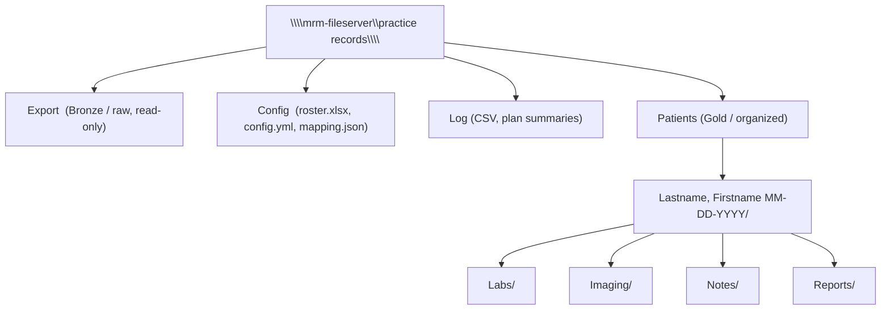
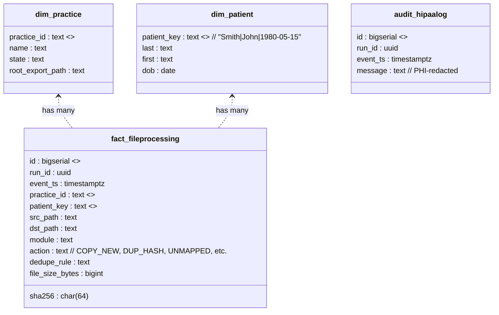

# Multi-Practice → Bronze/Silver/Gold → Warehouse Architecture

**Medical Records ETL System - Enterprise Architecture**

This document visualizes the end-to-end flow from multiple practice exports through the Universal Router to organized patient folders and the data warehouse.

---

## 1) End-to-End Flow (Multi-Practice Processing)

This diagram shows how multiple practices feed into Bronze storage, flow through the Universal Router pipeline, and end up in Gold patient folders while logging everything to the warehouse.

```mermaid
flowchart LR
  %% PRACTICES
  subgraph Practices ["Practices (Multiple Locations)"]
    A1["Triangle ENT\n(Export)"]
    A2["Valley Neurology\n(Export)"]
    A3["Alexander OBGYN\n(Export)"]
  end

  %% BRONZE
  subgraph Bronze["Bronze (Raw, Read-Only)"]
    B1["\\\\mrm-fileserver\\practice records\\<STATE>\\<PRACTICE>\\Export"]
  end

  %% ROUTER
  subgraph Router["Universal Router API/Service"]
    R1["Config Validation\n(JSON Schema)"]
    R2["Roster Autodetect\n(last/first/dob + confidence)"]
    R3["Identity Match\n(filename/roster/fuzzy)"]
    R4["Module Classifier\n(Labs/Imaging/Notes/Reports)"]
    R5["Dedup Rules\n(hash, name+size+module)"]
    R6["Plan → Execute\n(dry-run → real-run)"]
  end

  %% SILVER/GOLD
  subgraph Silver["Silver (Clean/Normalized)"]
    S1["Flattened/standardized\n(optional per practice)"]
  end
  subgraph Gold["Gold (Patient Folders)"]
    G1["\\\\mrm-fileserver\\practice records\\<STATE>\\<PRACTICE>\\Patients\\<br/>Lastname, Firstname MM-DD-YYYY/<br/> ├─ Labs/<br/> ├─ Imaging/<br/> ├─ Notes/<br/> └─ Reports/"]
  end

  %% LOGS + WAREHOUSE + DASH
  subgraph Logging["Logs"]
    L1["CSV (PHI-redacted)"]
    L2["Audit stream"]
  end
  subgraph Warehouse["SQL Data Warehouse"]
    W1["fact_fileprocessing"]
    W2["dim_patient"]
    W3["dim_practice"]
    W4["audit_hipaalog"]
  end

  subgraph Dash["Ops Dashboard / Postman"]
    D1["/api/stats\n/api/unmapped\n/api/recent-runs\n/api/identity/preview"]
  end

  %% WIRES
  A1 -->|copy (read-only)| B1
  A2 -->|copy (read-only)| B1
  A3 -->|copy (read-only)| B1

  B1 --> R1
  R1 --> R2 --> R3 --> R4 --> R5 --> R6

  R6 -->|optional| S1 --> G1
  R6 -->|direct| G1

  R6 --> L1
  R6 --> W1
  R6 --> W4
  R2 --> W2
  R6 --> W3

  D1 <-->|monitor/control| R6
```

**Key Flow:**
1. **Practices export** raw files to Bronze (read-only copy)
2. **Router validates** config, auto-detects roster columns
3. **Identity matching** links files to patients (filename → roster)
4. **Module classification** categorizes files (Labs/Imaging/Notes/Reports)
5. **Deduplication** prevents duplicate copies (hash-based or name+size+module)
6. **Execution** moves files to Gold patient folders
7. **Logging** writes PHI-redacted CSV and warehouse facts

---

## 2) Folder Convention (Per Practice)

Each practice has a standardized folder structure on the file server:



**Example Practice Paths:**

**Triangle ENT (North Carolina):**
```
\\mrm-fileserver\practice records\NC\Triangle_ENT\
  ├── Export\           (Bronze - raw files from practice)
  ├── Config\           (roster.xlsx, config.yml)
  ├── Log\              (processing logs, CSV audit trails)
  └── Patients\         (Gold - organized patient folders)
      ├── Smith, John 05-15-1980\
      │   ├── Labs\
      │   ├── Imaging\
      │   ├── Notes\
      │   └── Reports\
      └── Johnson, Mary 03-20-1975\
          ├── Labs\
          ├── Imaging\
          ├── Notes\
          └── Reports\
```

**Valley Neurology (California):**
```
\\mrm-fileserver\practice records\CA\Valley_Neurology\
  ├── Export\
  ├── Config\
  ├── Log\
  └── Patients\
```

**Alexander OBGYN (Texas):**
```
\\mrm-fileserver\practice records\TX\Alexander_OBGYN\
  ├── Export\
  ├── Config\
  ├── Log\
  └── Patients\
```

---

## 3) Warehouse Entities (Analytics Layer)

The SQL data warehouse tracks all processing events for analytics and auditing:



**Warehouse Tables:**

| Table | Purpose | Key Fields |
|-------|---------|------------|
| `dim_practice` | Practice master data | practice_id, name, state, export_path |
| `dim_patient` | Patient master (de-identified key) | patient_key (hash), last, first, dob |
| `fact_fileprocessing` | Every file action logged | run_id, practice, patient, action, module |
| `audit_hipaalog` | HIPAA audit trail (PHI-redacted) | run_id, event_ts, redacted_message |

**Example Analytics Queries:**

```sql
-- Files processed per practice (last 30 days)
SELECT 
  p.name AS practice,
  COUNT(*) AS files_processed,
  COUNT(DISTINCT f.patient_key) AS unique_patients,
  SUM(CASE WHEN f.action = 'COPY_NEW' THEN 1 ELSE 0 END) AS new_files,
  SUM(CASE WHEN f.action LIKE 'DUP_%' THEN 1 ELSE 0 END) AS duplicates
FROM fact_fileprocessing f
JOIN dim_practice p ON f.practice_id = p.practice_id
WHERE f.event_ts > NOW() - INTERVAL '30 days'
GROUP BY p.name;

-- Unmapped rate by practice
SELECT 
  p.name,
  COUNT(*) AS total_files,
  SUM(CASE WHEN f.action = 'UNMAPPED' THEN 1 ELSE 0 END) AS unmapped,
  ROUND(100.0 * SUM(CASE WHEN f.action = 'UNMAPPED' THEN 1 ELSE 0 END) / COUNT(*), 2) AS unmapped_pct
FROM fact_fileprocessing f
JOIN dim_practice p ON f.practice_id = p.practice_id
GROUP BY p.name
HAVING COUNT(*) > 0
ORDER BY unmapped_pct DESC;
```

---

## Usage Notes

### 🔒 Bronze is Sacred (Read-Only)
- **Bronze layer** = raw practice exports, NEVER modified
- Router copies FROM Bronze TO Gold
- Source files remain untouched for audit/compliance
- `safety.source_readonly_check: true` enforces this

### 🔄 Plan → Execute (Dry-Run First)
- **Always dry-run first** to preview what will happen
- If unmapped% > 60%, HTTP 409 blocks real-run
- Review `/api/unmapped` to see unmatched files
- Only run real processing after validation

### 🎯 Roster Autodetect
- Use `GET /api/identity/preview?roster=path/to/file.xlsx` before processing
- System auto-detects columns: `last_name`, `first_name`, `dob`
- Handles variations: `lastname`, `Last Name`, `surname`, etc.
- Confidence scoring (0.0-1.0) shows detection certainty
- Sample data preview shows first 5 patients

### 📦 Per-Practice Configuration
- Each practice has a **Practice Pack**:
  - `roster.xlsx` - Patient master list
  - `config.yml` - Practice-specific settings (keywords, naming, dedup rules)
  - `samples/` - Test files for smoke testing
- Generate new packs: `python tools/make_practice_pack.py --name "Practice Name"`

### 📊 Logs Feed Warehouse
- **CSV logs** mirror to warehouse tables
- `fact_fileprocessing` = every file action (copy, dedup, unmapped)
- `dim_patient`, `dim_practice` = master dimensions
- `audit_hipaalog` = HIPAA-compliant audit trail (PHI redacted)
- Query warehouse for analytics, compliance reporting

### 🎛️ Dashboard Monitoring
- **Postman or Web UI** calls REST API:
  - `GET /api/stats` - Overall statistics
  - `GET /api/unmapped` - Files that didn't match roster
  - `GET /api/recent-runs` - Processing history
  - `GET /api/identity/preview` - Test roster detection
- Real-time monitoring of processing health

---

## Real-World Example

**Scenario:** Valley Neurology sends 150 patient files

1. **Practice exports** 150 files to:
   ```
   \\mrm-fileserver\practice records\CA\Valley_Neurology\Export\
   ```

2. **Postman request** (dry-run):
   ```json
   POST http://localhost:5000/api/process
   {
     "source": "\\\\mrm-fileserver\\practice records\\CA\\Valley_Neurology\\Export",
     "dest": "\\\\mrm-fileserver\\practice records\\CA\\Valley_Neurology\\Patients",
     "dry_run": true,
     "mapping": {
       "identity": {
         "roster": {
           "path": "\\\\mrm-fileserver\\practice records\\CA\\Valley_Neurology\\Config\\roster.xlsx"
         }
       }
     }
   }
   ```

3. **Router processes**:
   - ✅ Validates roster.path exists
   - ✅ Auto-detects columns: `Last Name`, `First Name`, `DOB`
   - ✅ Matches 148/150 files to patients
   - ⚠️ 2 files unmapped (1.3% - under 60% threshold)

4. **Response** (HTTP 200):
   ```json
   {
     "status": "success",
     "mode": "DRY_RUN",
     "stats": {
       "processed": 150,
       "copied": 148,
       "unmapped": 2
     },
     "message": "Processing completed successfully"
   }
   ```

5. **Review unmapped**:
   ```
   GET /api/unmapped
   → Shows 2 files that didn't match roster
   ```

6. **Fix roster**, re-run dry-run (now 150/150 match)

7. **Real run** (dry_run: false):
   ```
   ✅ 150 files organized into Gold patient folders
   ✅ CSV log written to Log/
   ✅ Warehouse updated (fact_fileprocessing, dim_patient)
   ```

8. **Result**:
   ```
   \\mrm-fileserver\practice records\CA\Valley_Neurology\Patients\
     ├── Anderson, Lisa 01-15-1982\
     │   ├── Labs\
     │   │   └── bloodwork_2024.pdf
     │   ├── Imaging\
     │   │   └── mri_brain_2024.pdf
     │   └── Notes\
     │       └── progress_note.pdf
     └── ... (149 more patients)
   ```

---

## Summary

| Layer | Purpose | Location | Mutability |
|-------|---------|----------|------------|
| **Bronze** | Raw practice exports | `\\...\<PRACTICE>\Export` | Read-only |
| **Silver** | Clean/normalized (optional) | `\\...\<PRACTICE>\Silver` | Intermediate |
| **Gold** | Organized patient folders | `\\...\<PRACTICE>\Patients` | Final output |
| **Warehouse** | Analytics/audit | PostgreSQL database | Append-only |
| **Logs** | Processing audit trail | `\\...\<PRACTICE>\Log` | Append-only |

**Key Principles:**
- 🔒 Bronze is sacred (never modified)
- 🎯 Always dry-run first
- 🧪 Preview roster detection before processing
- 📦 Use Practice Packs for easy onboarding
- 📊 Warehouse tracks everything for analytics
- 🚨 High unmapped rate (>60%) blocks execution

**Next Steps:**
1. Generate Practice Packs for each location
2. Preview roster detection with `/api/identity/preview`
3. Dry-run processing to validate mapping
4. Monitor unmapped rates and fix roster issues
5. Execute real runs after validation
6. Query warehouse for compliance/analytics

---

**For more details, see:**
- `QUICK_WINS_IMPLEMENTED.md` - Quick Wins features (validation, autodetect, warnings)
- `COMPLETE_ARCHITECTURE_GUIDE.md` - Full technical architecture
- `YOUR_POSTMAN_REQUEST.md` - API request examples
