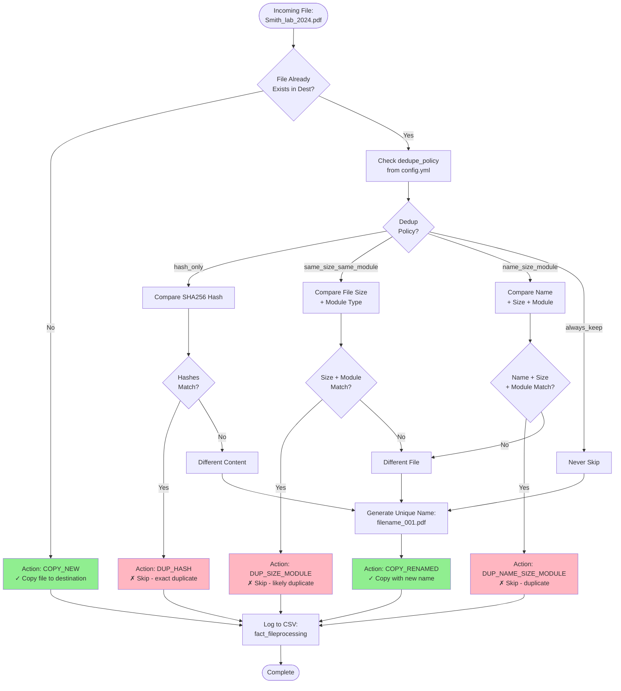
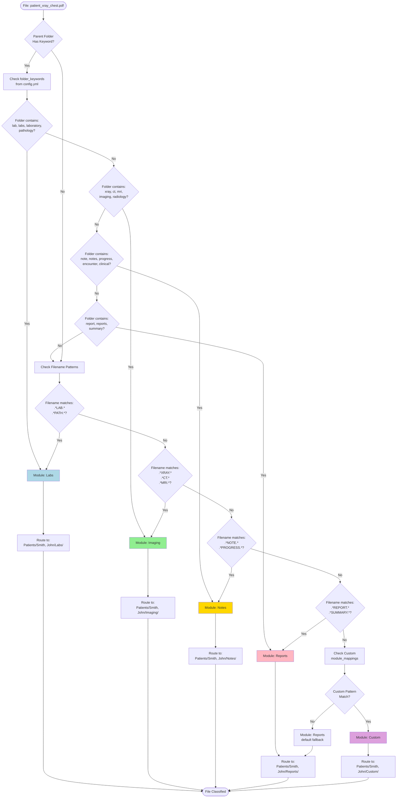
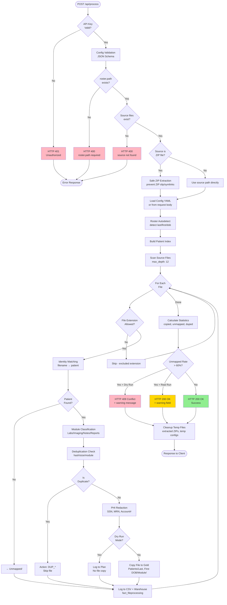
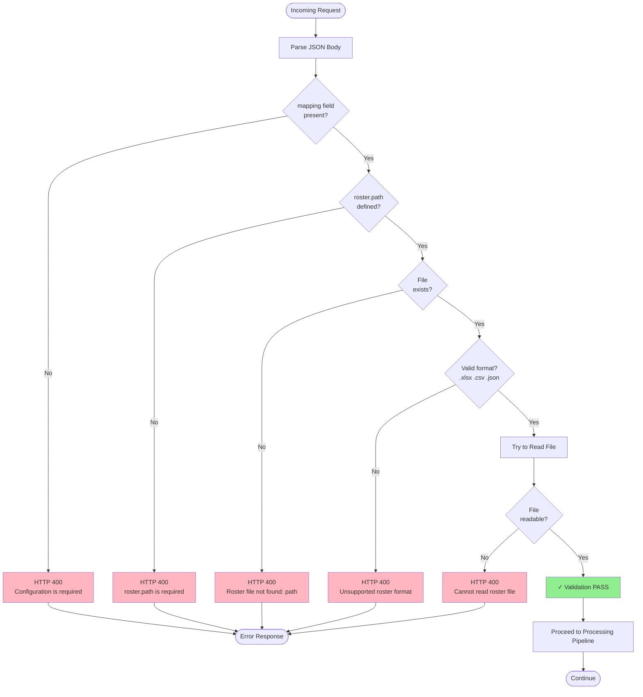

# Detailed Algorithm Flowcharts

**Medical Records ETL System - Internal Logic**

Visual diagrams showing how the core algorithms work internally.

---

## 1) Identity Matching Algorithm (Filename → Patient)

This flowchart shows how the system matches a file to a patient using fuzzy matching on the filename.

```mermaid
flowchart TD
    Start([File: Smith_John_1980-05-15_lab.pdf]) --> ParseName[Parse Filename]
    
    ParseName --> Extract[Extract Components:<br/>Last = Smith<br/>First = John<br/>DOB = 1980-05-15]
    
    Extract --> LoadRoster[Load Roster<br/>from roster.xlsx]
    
    LoadRoster --> Autodetect{Autodetect<br/>Columns?}
    
    Autodetect -->|Yes| DetectCols[Detect last/first/dob<br/>columns with confidence]
    Autodetect -->|No| UseDefined[Use defined<br/>column mappings]
    
    DetectCols --> BuildIndex[Build Patient Index<br/>Key = Last|First|DOB]
    UseDefined --> BuildIndex
    
    BuildIndex --> ExactMatch{Exact Match<br/>Found?}
    
    ExactMatch -->|Yes| MatchFound[✓ Patient Matched<br/>Confidence: 1.0]
    
    ExactMatch -->|No| FuzzyLast{Fuzzy Match<br/>Last Name?<br/>threshold: 0.85}
    
    FuzzyLast -->|Match| FuzzyFirst{Fuzzy Match<br/>First Name?<br/>threshold: 0.85}
    
    FuzzyFirst -->|Match| DOBMatch{DOB<br/>Matches?}
    
    DOBMatch -->|Yes| MatchFound2[✓ Patient Matched<br/>Confidence: 0.90]
    DOBMatch -->|No| PartialMatch[⚠ Partial Match<br/>Confidence: 0.60]
    
    FuzzyFirst -->|No Match| NoMatch
    FuzzyLast -->|No Match| NoMatch[✗ No Match<br/>→ UNMAPPED]
    
    MatchFound --> Route[Route to:<br/>Patients/Smith, John 05-15-1980/]
    MatchFound2 --> Route
    PartialMatch --> ManualReview[→ Manual Review Queue]
    NoMatch --> Unmapped[→ Unmapped/]
    
    Route --> End([File Copied])
    ManualReview --> End2([Queued for Review])
    Unmapped --> End3([File in Unmapped/])
    
    style MatchFound fill:#90EE90
    style MatchFound2 fill:#90EE90
    style PartialMatch fill:#FFD700
    style NoMatch fill:#FFB6C1
```

**Matching Logic:**
1. **Parse filename** for patient identifiers (last, first, DOB)
2. **Autodetect** roster columns (or use defined mappings)
3. **Exact match** first (fastest path)
4. **Fuzzy match** if exact fails (handles typos)
5. **Confidence scoring**:
   - Exact: 1.0
   - Fuzzy + DOB: 0.90
   - Fuzzy only: 0.60
   - No match: → Unmapped

---

## 2) Deduplication Decision Tree

This flowchart shows how the system decides whether to copy, skip, or rename files based on deduplication rules.



**Dedup Policies:**

| Policy | Checks | Use Case |
|--------|--------|----------|
| `hash_only` | SHA256 hash | Strict - only skip if binary identical |
| `same_size_same_module` | File size + module type | Fast - likely duplicates |
| `name_size_module` | Name + size + module | Balanced - good default |
| `always_keep` | Nothing | Keep all files (rename if needed) |

---

## 3) Module Classification Logic (Labs/Imaging/Notes/Reports)

This flowchart shows how files are categorized into clinical modules.



**Classification Priority:**
1. **Folder keywords** (fastest - checks parent folder name)
2. **Filename patterns** (regex matching on file name)
3. **Custom mappings** (user-defined patterns in config.yml)
4. **Default fallback** (Reports if no match)

---

## 4) Processing Pipeline (End-to-End Execution)

This flowchart shows the complete processing flow from API request to file organization.



**Pipeline Stages:**

| Stage | Purpose | On Failure |
|-------|---------|------------|
| **Authentication** | Verify API key (if enabled) | HTTP 401 |
| **Config Validation** | Check roster.path, file formats | HTTP 400 |
| **ZIP Extraction** | Safe extraction (prevent attacks) | HTTP 400 |
| **Autodetect** | Find patient columns automatically | Use defaults |
| **Identity Match** | Link files to patients | → Unmapped |
| **Classification** | Categorize to module | → Reports (default) |
| **Deduplication** | Skip duplicate files | Log as DUP_* |
| **PHI Redaction** | Remove sensitive data from logs | Always enforced |
| **Execution** | Copy files (or plan in dry-run) | Log errors |
| **Statistics** | Calculate unmapped rate | Warn if >60% |

---

## 5) Config Validation Flow (Quick Wins Feature)

This flowchart shows the new validation system that prevents silent failures.



**What Validation Prevents:**
- ❌ **Silent failures** (roster.path = null)
- ❌ **File not found errors** mid-processing
- ❌ **Wrong file formats** causing crashes
- ❌ **Permission issues** discovered late

**What You Get:**
- ✅ **Immediate feedback** (HTTP 400 with clear message)
- ✅ **Actionable errors** (tells you exactly what's missing)
- ✅ **Early validation** (before any processing starts)

---

## Real-World Example: Complete Flow

**Scenario:** Process 10 patient files from Valley Neurology

```
Input: 10 PDFs in Export folder
Roster: patients.xlsx with 8 patients
```

**Flow:**

1. **API Request** → Validate API key ✓
2. **Config Validation** → roster.path exists ✓
3. **Autodetect** → Finds "Last Name", "First Name", "DOB" ✓
4. **Build Index** → 8 patients loaded into index
5. **Scan Files** → 10 PDFs found

**Per-File Processing:**

| File | Identity Match | Module | Dedup | Action |
|------|----------------|--------|-------|--------|
| Smith_lab.pdf | ✓ Smith, John | Labs | New | COPY_NEW |
| Johnson_xray.pdf | ✓ Johnson, Mary | Imaging | New | COPY_NEW |
| Smith_lab.pdf | ✓ Smith, John | Labs | DUP_HASH | Skip |
| Brown_mri.pdf | ✓ Brown, Patricia | Imaging | New | COPY_NEW |
| Wilson_note.pdf | ✗ No match | Notes | - | UNMAPPED |
| Davis_report.pdf | ✗ No match | Reports | - | UNMAPPED |
| Smith_lab_2.pdf | ✓ Smith, John | Labs | DUP_SIZE | Skip |
| Johnson_ct.pdf | ✓ Johnson, Mary | Imaging | New | COPY_NEW |
| Anderson_lab.pdf | ✓ Anderson, Lisa | Labs | New | COPY_NEW |
| Martinez_xray.pdf | ✗ No match | Imaging | - | UNMAPPED |

**Statistics:**
```
Processed: 10
Copied: 5 (50%)
Duplicates: 2 (20%)
Unmapped: 3 (30%)
```

**Unmapped Rate:** 30% (< 60% threshold) → ✓ No warning

**Result:**
```
Patients/
├── Anderson, Lisa 01-15-1982/
│   └── Labs/
│       └── Anderson_lab.pdf
├── Brown, Patricia 03-10-1985/
│   └── Imaging/
│       └── Brown_mri.pdf
├── Johnson, Mary 03-20-1975/
│   └── Imaging/
│       ├── Johnson_xray.pdf
│       └── Johnson_ct.pdf
└── Smith, John 05-15-1980/
    └── Labs/
        └── Smith_lab.pdf

Unmapped/
├── Wilson_note.pdf
├── Davis_report.pdf
└── Martinez_xray.pdf
```

---

## Summary: Algorithm Decision Points

| Algorithm | Key Decision | Fast Path | Slow Path |
|-----------|--------------|-----------|-----------|
| **Identity Match** | Exact vs Fuzzy | Exact match (hash lookup) | Fuzzy matching (iterative) |
| **Deduplication** | Hash vs Metadata | SHA256 comparison | Name+Size+Module check |
| **Classification** | Folder vs Filename | Folder keyword match | Regex pattern matching |
| **Validation** | File exists? | Direct path check | Try read + format validation |

**Performance Tips:**
- Use **exact matching** when possible (faster than fuzzy)
- Use **folder keywords** for classification (faster than regex)
- Use **metadata dedup** (`same_size_same_module`) instead of hashing for speed
- **Autodetect once** per roster, cache results

---

**Related Documents:**
- `BRONZE_SILVER_GOLD_ARCHITECTURE.md` - High-level architecture
- `QUICK_WINS_IMPLEMENTED.md` - Validation and autodetect features
- `COMPLETE_ARCHITECTURE_GUIDE.md` - Full technical guide
