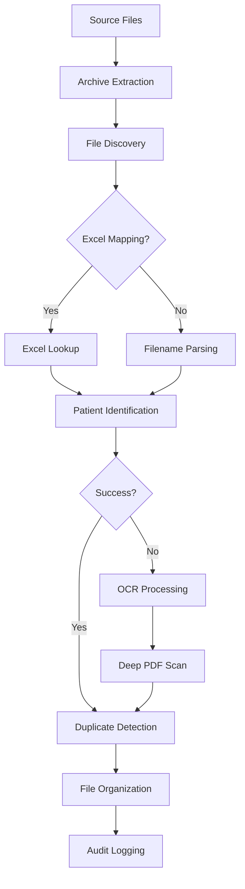

# 🏥 Medical ETL System

[](https://www.python.org/downloads/)
[](LICENSE)
[](https://github.com/psf/black)
[](https://github.com/yourusername/medical-etl-system/graphs/commit-activity)

> **A comprehensive, production-ready ETL system for processing medical records with intelligent patient identification and file organization.**

## ✨ Features

- 🔄 **Dual Processing Modes**: Excel mapping + intelligent filename/OCR extraction
- 🧠 **Smart Patient Identification**: 5-level fallback system with OCR support
- 📁 **Intelligent File Organization**: Automatic patient folder creation with deduplication
- 🔍 **Advanced OCR**: Tesseract integration with configurable languages
- 📊 **Comprehensive Logging**: Detailed audit trails with smart log rotation
- 🗜️ **Archive Support**: ZIP, RAR, 7Z, TAR extraction
- ⚙️ **Zero Hardcoded Values**: Fully configurable via environment variables
- 🐳 **Docker Ready**: Container deployment support
- 🖥️ **Cross-Platform**: Windows, Linux, macOS compatibility

## 🚀 Quick Start

### 1. Clone and Setup

```bash
git clone https://github.com/yourusername/medical-etl-system.git
cd medical-etl-system

# Create virtual environment
python -m venv .venv
source .venv/bin/activate  # On Windows: .venv\Scripts\activate

# Install dependencies
pip install -r requirements.txt
```

### 2. Install Tesseract OCR

**Windows:**
```bash
# Download from: https://github.com/UB-Mannheim/tesseract/wiki
# Or use chocolatey:
choco install tesseract
```

**Ubuntu/Debian:**
```bash
sudo apt-get install tesseract-ocr
```

**macOS:**
```bash
brew install tesseract
```

### 3. Configure Environment

```bash
# Copy example configuration
cp config/environment_example.env config/.env

# Edit config/.env with your settings (optional - auto-detection works)
```

### 4. Process Your First Dataset

```bash
# Basic processing (auto-detects Tesseract)
python main.py --source "/path/to/medical/files" --destination "/path/to/organized/output"

# With Excel mapping file
python main.py --source "/path/to/dataset" --destination "/path/to/output" --mapping "/path/to/mapping.xlsx"

# Preview mode (dry run)
python main.py --source "/path/to/dataset" --destination "/path/to/output" --dry-run
```

## 📋 System Requirements

- **Python**: 3.8 or higher
- **Tesseract OCR**: Auto-detected or configurable
- **Memory**: 4GB+ recommended for large datasets
- **Storage**: Depends on dataset size (system creates organized copies)

## 🔧 Configuration

### Environment Variables (.env file)

| Variable | Default | Description |
|----------|---------|-------------|
| `TESSERACT_CMD` | Auto-detected | Path to Tesseract executable |
| `LOG_LEVEL` | INFO | Logging level (DEBUG, INFO, WARNING, ERROR) |
| `WORKER_THREADS` | 4 | Number of processing threads |
| `MAX_FILE_SIZE_MB` | 100 | Maximum file size for processing |
| `OCR_LANGUAGES` | eng | OCR languages (comma-separated) |

📖 **Full configuration guide:** [PRODUCTION_SETUP.md](PRODUCTION_SETUP.md)

## 📊 Processing Pipeline



## 📁 Output Structure

```
destination/
├── Smith, John 01-15-1990/
│   ├── 2022_chest_xray.pdf
│   ├── 2023_blood_work.pdf
│   └── 2024_consultation.pdf
├── duplicates/
│   └── Smith, John 01-15-1990/
│       └── duplicate_xray.pdf
└── unmapped/
    └── unidentified_file.pdf
```

## 🐳 Docker Deployment

```dockerfile
FROM python:3.12-slim

# Install system dependencies
RUN apt-get update && apt-get install -y \
    tesseract-ocr \
    tesseract-ocr-eng \
    libmagic1 \
    && rm -rf /var/lib/apt/lists/*

# Set working directory
WORKDIR /app

# Copy and install requirements
COPY requirements.txt .
RUN pip install --no-cache-dir -r requirements.txt

# Copy application
COPY . .

# Set environment variables
ENV TESSERACT_CMD=/usr/bin/tesseract
ENV PYTHONPATH=/app

# Create directories
RUN mkdir -p data logs temp

# Run application
CMD ["python", "main.py", "--help"]
```

```bash
# Build and run
docker build -t medical-etl .
docker run -v /your/data:/app/input -v /your/output:/app/output medical-etl \
  python main.py --source /app/input --destination /app/output
```

## 🧪 Testing

```bash
# Run all tests
pytest

# Run with coverage
pytest --cov=modules --cov-report=html

# Test specific functionality
python process_dataset1.py --demo

# Validate configuration
python -c "from config.config import load_environment_config; print('✅ Configuration loaded successfully')"
```

## 📝 Usage Examples

### Basic Medical Records Processing
```bash
python main.py \
  --source "/data/medical_records" \
  --destination "/organized/patients" \
  --verbose
```

### With Excel Patient Mapping
```bash
python main.py \
  --source "/data/clinic_files" \
  --destination "/processed/patients" \
  --mapping "/data/patient_roster.xlsx"
```

### Batch Processing with Custom Settings
```bash
# Set environment
export OCR_LANGUAGES="eng,spa"
export WORKER_THREADS="8"
export LOG_LEVEL="DEBUG"

python main.py \
  --source "/bulk/medical/data" \
  --destination "/organized/output"
```

## 🔒 Security & Compliance

- ✅ **No hardcoded paths** - Environment-based configuration
- ✅ **Audit trails** - Comprehensive logging of all operations
- ✅ **File integrity** - Source files remain unchanged
- ✅ **Duplicate handling** - Preserves all file variations
- ✅ **Error handling** - Graceful failure recovery

⚠️ **Important**: This system processes copies of files. Original medical records remain untouched.

## 📚 Documentation

- 📖 **[Production Setup Guide](PRODUCTION_SETUP.md)** - Complete deployment instructions
- 📊 **[Excel Mapping Formats](EXCEL_FORMATS.md)** - Mapping file specifications
- 🔧 **[Processing Pipeline Details](ENHANCED_PROCESSING.md)** - Technical documentation
- 📁 **[File Organization Structure](LOCATION_MAP.md)** - Output directory layout

## 🤝 Contributing

We welcome contributions! Please see our [Contributing Guidelines](CONTRIBUTING.md) for details.

1. Fork the repository
2. Create a feature branch (`git checkout -b feature/amazing-feature`)
3. Commit your changes (`git commit -m 'Add amazing feature'`)
4. Push to the branch (`git push origin feature/amazing-feature`)
5. Open a Pull Request

## 📄 License

This project is licensed under the MIT License - see the [LICENSE](LICENSE) file for details.

## 🆘 Support

- 📧 **Issues**: [GitHub Issues](https://github.com/yourusername/medical-etl-system/issues)
- 💬 **Discussions**: [GitHub Discussions](https://github.com/yourusername/medical-etl-system/discussions)
- 📖 **Documentation**: [Wiki](https://github.com/yourusername/medical-etl-system/wiki)

## 🙏 Acknowledgments

- [Tesseract OCR](https://github.com/tesseract-ocr/tesseract) for optical character recognition
- [pandas](https://pandas.pydata.org/) for data manipulation
- [pytesseract](https://github.com/madmaze/pytesseract) for Python OCR integration
- [pdf2image](https://github.com/Belval/pdf2image) for PDF processing

---

<div align="center">

**[⭐ Star this repository](https://github.com/yourusername/medical-etl-system)** if you find it useful!

Made with ❤️ for healthcare data processing

</div>