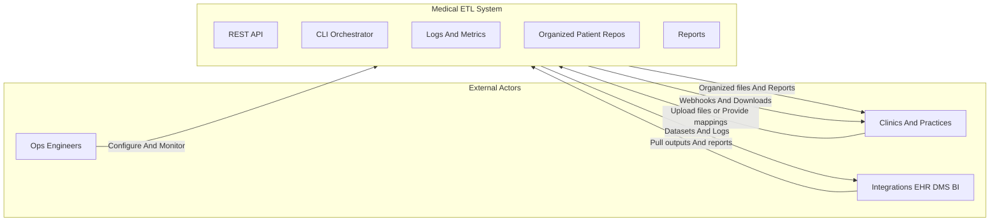
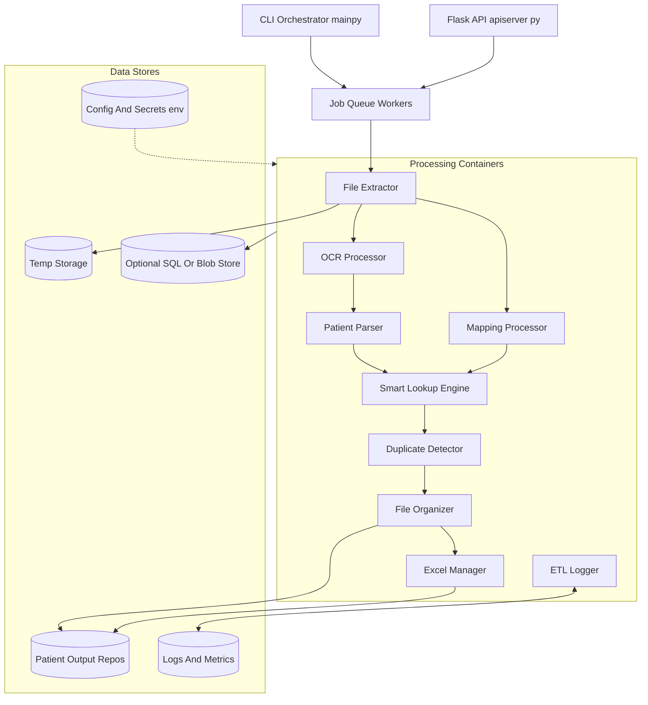
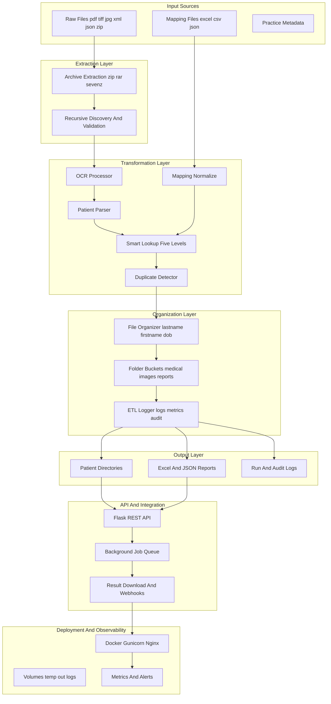
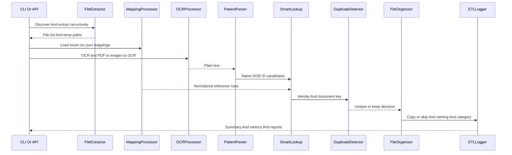
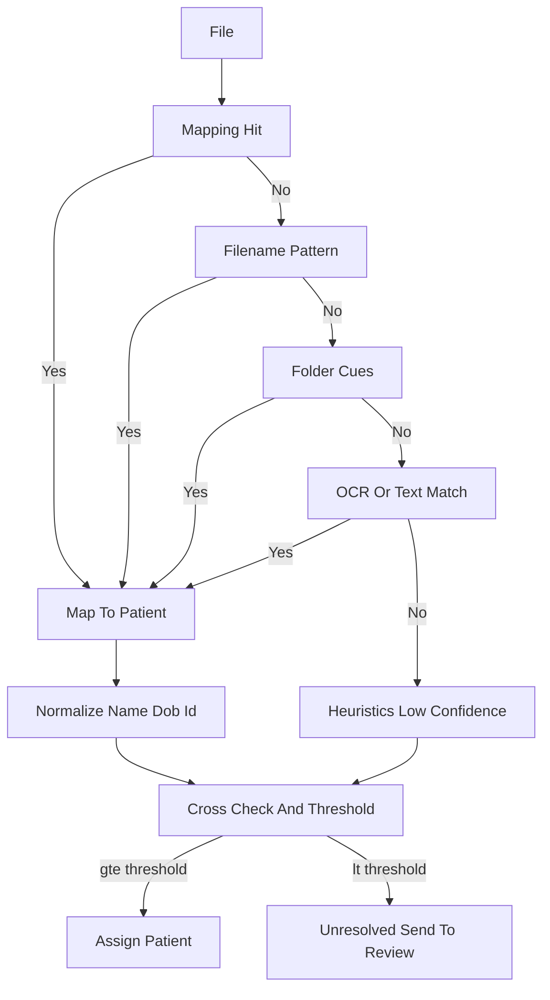
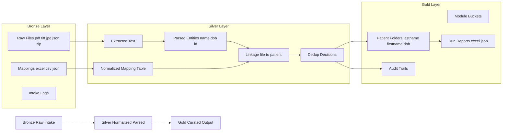
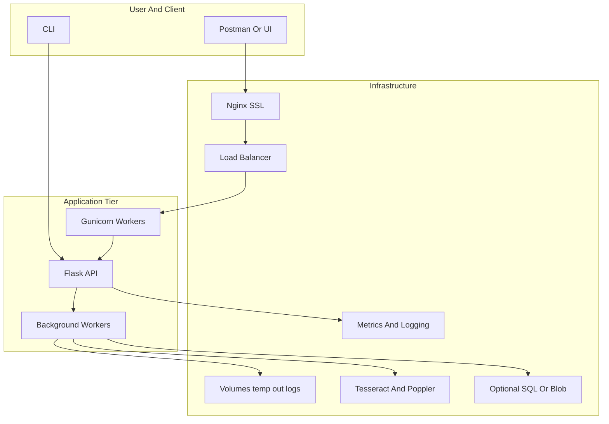

# Medical ETL System — Complete Architecture (All-in-One)

## 1) System Context

---

## 2) Container Architecture

---

## 3) End-to-End Architecture Flow

---

## 4) Processing Pipeline (Swimlane)

---

## 5) Five-Level Patient Identification

---

## 6) Bronze to Silver to Gold Data Flow

---

## 7) Deployment And Runtime Topology

